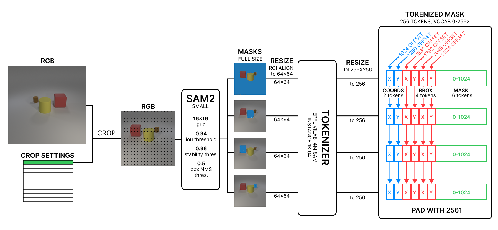
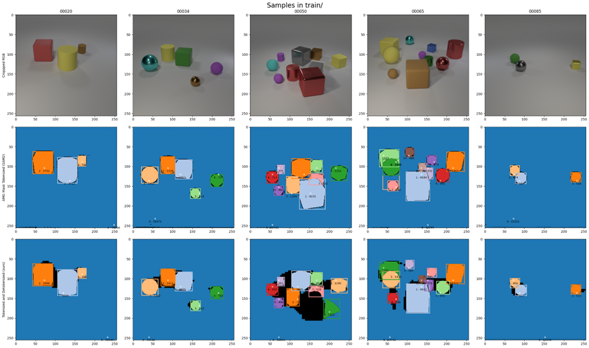
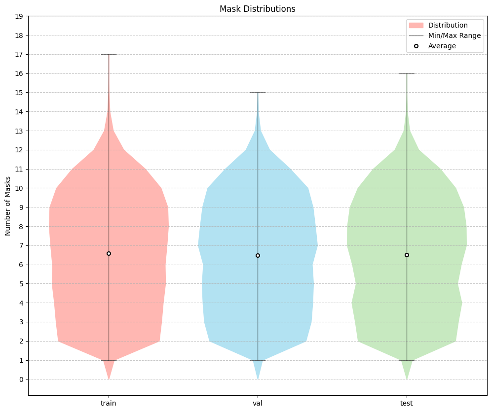

## Pipeline

The project extends multiCLEVR with SAM-derived instance segmentation tokens. Each RGB scene is pseudo-labeled with SAM 2.1, filtered for stable masks, converted to normalized mask crops, and then tokenized with the pretrained 4M SAM tokenizer.

## Tokenization

Each segmentation instance is represented with coordinates, bounding-box information, and mask tokens. To avoid collisions with the vocabularies used by the other modalities, SAM token IDs are stored in a dedicated offset range.

{fig-alt="Tokenization pipeline for train sample 20" width="60%"}

FIgure: Tokenization pipeline for train sample 20

## Labeling

Extending the model with segmentation instances instances requires an accurately segmented and tokenized dataset aligned with the already present modalities. For this purpose, we extend the multiCLEVR dataset from EPFL's COM-304 course, which is composed of 50'000 train and 5'000 validation images, with 10 augmentation each. 

To compute our modality tokens, we pseudo-labeled the RGB dataset using Meta Research's SAM 2.1, extracting instance masks, and subsequently tokenizing them using the pre-trained 4M model tokenize.

{fig-alt="Examples of tokenized masks" width="60%"}

Figure: Examples of tokenized masks. First row: original cropped RGB image.  Second row: SAMv2.1 Small AMG masked image. Third row, tokenized & detokenized mask

{fig-alt="Mask_ratio" width="60%"}

Figure: Number of instance masks per image

## Training setup

The reported 5-modality model is trained jointly from scratch. All encoder and decoder parameters are initialized together, and SAM is treated as an additional masked prediction target within the same multimodal framework.

## Dataset structure

- 50,000 training scenes.
- 5,000 validation scenes.
- 10 augmentations per scene.
- One aligned file per modality per sample.

::: {.callout-note}
## Dataset Access
The full dataset used in this project is available on [Google Drive](https://drive.google.com/drive/folders/1LFaKm2GAzhHO01BgCajg3EJO_YjXfdnX){target="_blank"}.
:::
