## Modality losses

The model has been trained for around **5 hours** on 2 NVIDIA L40S GPUs.

The final validation loss of the model is as follow:

| Modality | Validation CE | Comment |
|---|---:|---|
| loss |  3.26 |
| scene\_desc | 0.29 | Low-entropy text target |
| tok\_sam@256 | 1.63 | Competitive among visual modalities |
| tok\_normal@256 | 4.13 | Harder structured visual prediction |
| tok\_depth@256 | 4.27 | Harder structured visual prediction |
| tok\_rgb@256 | 5.98 | Highest complexity among targets |

We observe a relative low loss for the SAM modality, caused by the the high frequency of highly predictable padding tokens required to reach the fixed 256-token length, which drastically lowers the overall entropy of the prediction task compared to dense visual modalities like RGB.

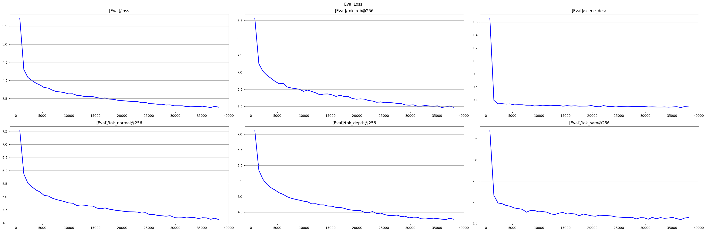{fig-alt="Eval loss" width="100%"}

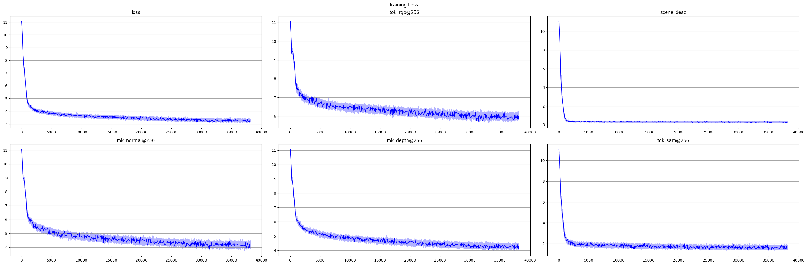{fig-alt="Training loss" width="100%"}

## Quantitative summary

The final project evaluation includes both segmentation overlap metrics and image-distribution metrics.

### Segmentation quality

We scored `RGB -> SAM` generations using **mean Intersection over Union**.

| Metric | Value | Notes |
|---|---:|---|
| Mean IoU (all masks) | 0.845 ± 0.113 | Across 26,494 evaluated masks |
| Mean IoU (per-mask run) | 0.844 ± 0.113 | Across 26,534 evaluated masks |
| mIoU (per-image mean IoU) | 0.855 ± 0.058 | Across 5,000 images |
| Min IoU | 0.130–0.131 | Worst-case masks remain poor |
| Max IoU | 1.000 | Best cases are perfect |

These IoU numbers show that the model often captures the coarse object layout reasonably well on synthetic CLEVR scenes. At the same time, the relatively large standard deviation and low minimum IoU indicate that performance is uneven across examples, with some masks reconstructed much worse than others.

A degradation in mask generation quality is observable for objects in close proximity or within images containing a large number of them. While better results are visible for low-density scenes with fewer, well-separated instances, the model clearly struggles with high occlusion and complex spatial overlaps.

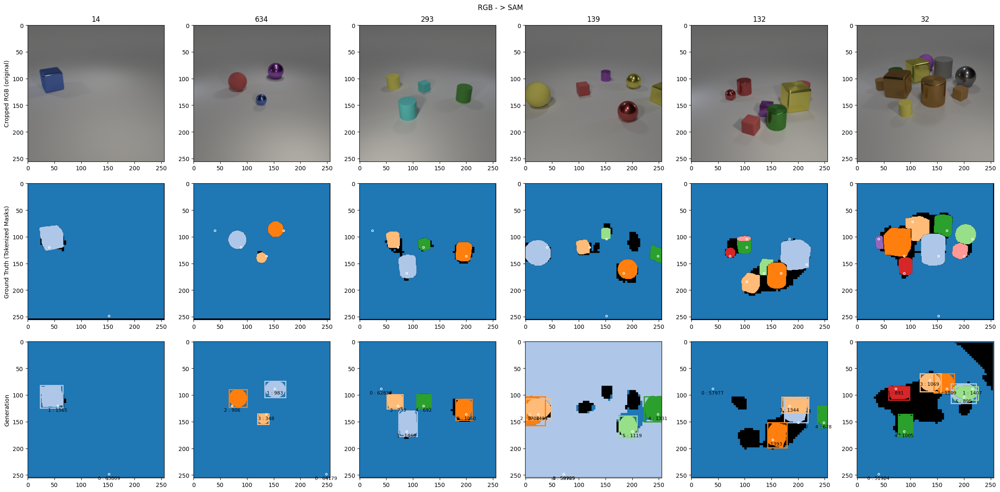

### FID

| FID comparison | Value | Interpretation |
|---|---:|---|
| GT vs decoded GT | 10.220 | Distortion introduced by tokenizer/decoder alone |
| Decoded GT tokens vs decoded predictions | 51.241 | Main reported evaluation FID over 4,000 samples |
| Decoded GT tokens vs decoded predictions | 47.888 | Same evaluation over 5,000 samples |
| Raw GT vs predictions (in-memory Inception) | 79.017 | Strong overall gap in image distribution |

The most meaningful FID for the model itself is the comparison between **decoded ground-truth tokens and decoded predictions**, because it partially factors out reconstruction loss caused by the tokenizer. Even under that fairer comparison, the FID remains high, so the generated outputs are still noticeably worse than the target distribution.

SAM tokens obtain a higher FID direct chaining (*modality -> RGB*) result compared to geometric modalities.

| | FID (Image Gen) |
|--- | --- |
| Normal -> RGB | 38.279 |
| Depth -> RGB | 42.073 |
| SAM -> RGB | 53.863 |
| Scene description -> RGB | 61.638 |

While cross modality chained generations does not have a significant increase when SAM is used as a middle-modality compared to normal and depth.

| Generation Chain |  FID |
| --- | --- |
| Text → Normal → RGB | 39.898 |
| Text → SAM → RGB |  40.189 |
| Text → Depth → SAM → RGB | 38.785 |
| Text → Normal → SAM → RGB | 40.213 |
| Text → SAM → Normal → RGB | 40.315 |
| Normal → SAM → RGB | 36.184 |
| Depth → SAM → RGB | 37.430 |
| SAM → Normal → RGB | 39.029 |

## Visual results

Here are qualitative examples of chain reconstruction and generation produced by our model.

::: {layout-ncol=3}
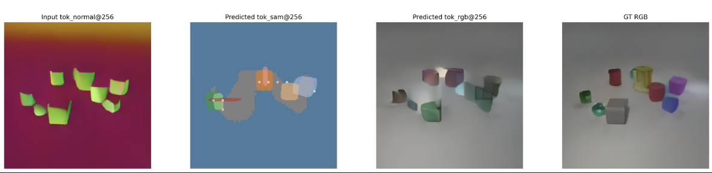{.lightbox group="results" width=100%}
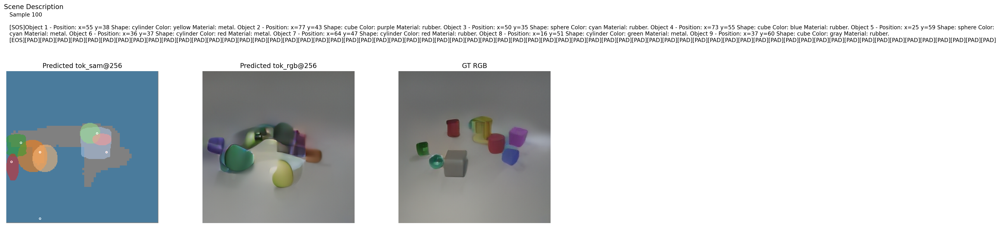{.lightbox group="results" width=100%}
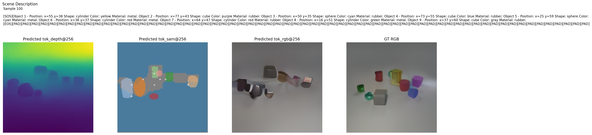{.lightbox group="results" width=100%}
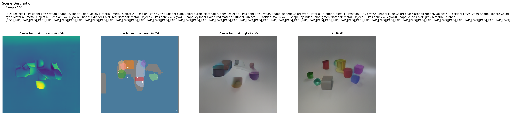{.lightbox group="results" width=100%}
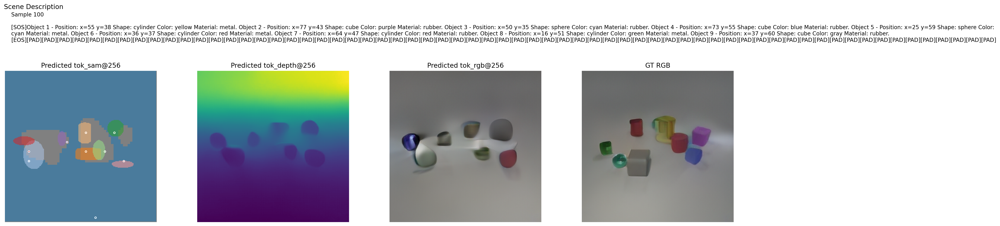{.lightbox group="results" width=100%}
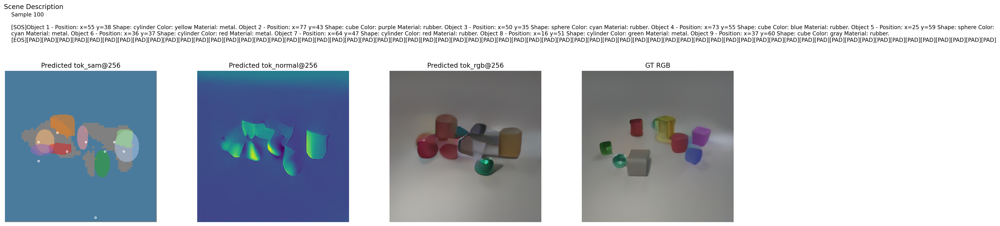{.lightbox group="results" width=100%}
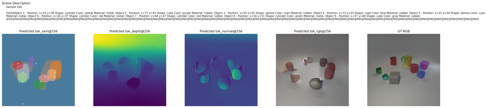{.lightbox group="results" width=100%}
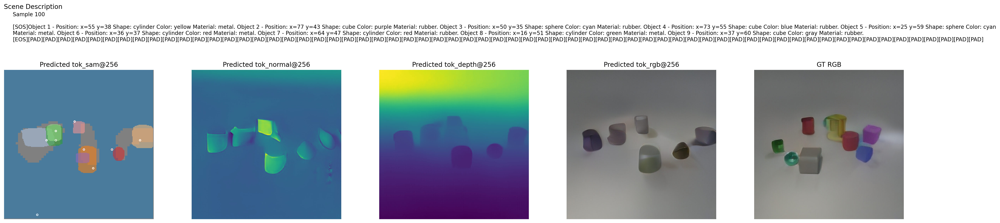{.lightbox group="results" width=100%}
:::

## Interpretation

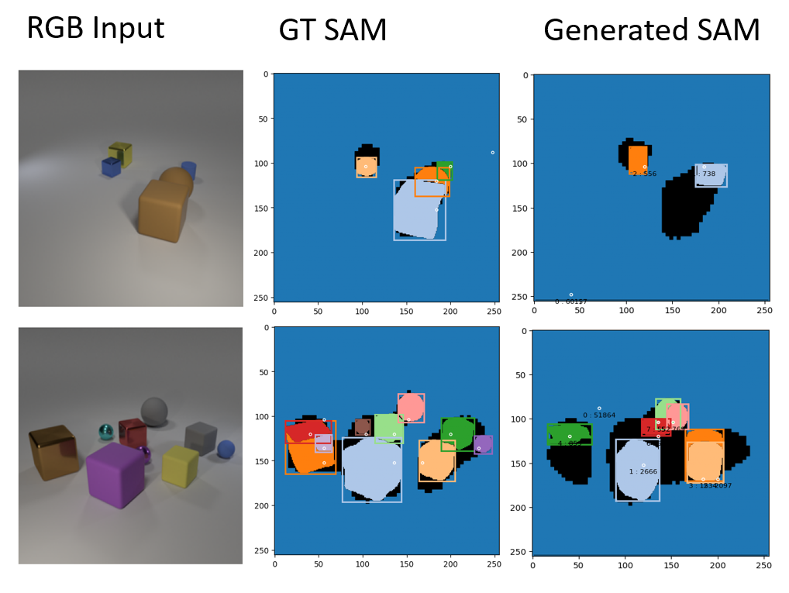{fig-alt="Comparison of rgb image, ground truth for SAM and generated SAM masks" width="100%"}

The quantitative picture is mixed. On one hand, IoU and mIoU suggest that the model often recovers useful segmentation structure; on the other hand, FID and the visual-token losses show that the generated outputs are still far from high-quality image synthesis.

This gap is not surprising for several reasons:

- The model is small relative to modern multimodal foundation models.
- Training lasts only 38'147 steps, which is a short run for a five-modality setup.
- CLEVR is synthetic and structurally simple, so IoU can look decent even when boundaries and fine appearance details are imperfect.
- Part of the image quality loss comes from the tokenizer-decoder pipeline itself, as shown by the non-zero FID of 10.220 between raw ground truth and decoded ground truth.
- SAM sequences are padded and truncated to fit a fixed representation, which can hurt fine mask fidelity.

::: {.callout-soft}
The fairest conclusion is that the extension is **functionally successful but not yet strong in absolute quality**. The model clearly learns to integrate SAM as a fifth modality and produces meaningful segmentation outputs, but the final generations remain limited by model scale, training budget, and tokenizer bottlenecks.
:::